# Heart-Failure-Prediction
## ABSTRACT  
Cardiovascular diseases (CVDs) are the leading cause of death worldwide, accounting for 17.9 million fatalities each year. The recent coronavirus pandemic has also been linked to causing cardiac problems, further exacerbating the situation. Early detection and management are crucial for individuals with CVDs or at high risk due to risk factors such as hypertension, diabetes, hyperlipidemia, or pre-existing disease. In this project, I aim to develop a predictive model that can identify the presence of heart disease based on a set of attributes or features using machine learning techniques for pattern recognition and accurate predictions.

## 1. INTRODUCTION  
Cardiovascular diseases (CVDs) are responsible for 17.9 million fatalities each year, and the recent coronavirus pandemic has also been linked to causing cardiac problems. As a result of excessive mental stress caused by the coronavirus, heart diseases (HD) are becoming increasingly widespread, particularly in metropolitan
areas. Early detection through common symptoms can be extremely helpful in mitigating the impact of these diseases. In this project, I utilize machine learning techniques for pattern recognition and accurate predictions of heart disease, enabling early diagnosis and intervention.

## 2. PROBLEM DEFINITION  
Early detection and management are crucial for individuals with cardiovascular disease or at high risk due to risk factors such as hypertension, diabetes, hyperlipidemia, or pre-existing disease. 

### 2.1. Aim  
The primary objective of this project is to develop a predictive model that can identify the presence of heart disease based on a set of attributes or features. The model should be able to:  
* Properly analyze the leading causes that contribute to heart failure.
* Classify if a person is prone to heart failure depending on the number of attributes required.
* Achieve high accuracy and generalization in predicting heart disease presence while minimizing false predictions.

## 3. PROPOSED METHOD  
To develop an effective predictive model for heart disease, I have combined five heart datasets and preprocessed the data to obtain a clean and consistent dataset. The final dataset consists of 918 observations with 11 common features, which are a mix of categorical and numerical variables. The features include:  
* Categorical Features: Sex, ChestPainType, RestingECG, ExerciseAngina, ST_Slope, FastingBS
* Numerical Features: Age, RestingBP, Cholesterol, MaxHR, Oldpeak
* Target Feature: 0 for normal heart readings else 1 for the presence of Heart Disease

Four different machine learning models, namely Logistic Regression, Decision Tree, K-Nearest Neighbors, and Naive Bayes, have been trained and evaluated with varying feature sets to determine the most effective approach for heart disease prediction.

> Figure 1: Methodology for the Project

## 4. EXPERIMENTS
### 4.1. Exploratory Data Analysis (EDA)
4.1.1. Distribution of categorical data. The visualization of categorical features to check how they have been transformed by the Label Encoder and if the features require scaling for uniform distribution. From the graphs, I can see that the categorial feature data is almost nearly normally distributed.  

4.1.2. Distribution of numerical data. Checking the distribution of numerical features to be able to detect features in need of scaling, visually. Here, I can observe that data distribution for Oldpeak is biased towards the right and data distribution for cholestrol is bimodel i.e two modes. Hence, I can mark them as features that require scaling during feature engineering.  

4.1.3. Distribution of target feature. Here, I have visualized to ensure that I have enough cases for both scenarios i.e. presence of Heart diseases and its absence since the data should have good distribution to be able to predict if person will have a heart failure or not.  

4.1.4. Extra Insights. Plotting the matrix representation for relationship between every feature of the dataset with any other feature. This is primarily done to check the relationship of feature pairs with one another since highly correlated features can reduce the efficiency of the model. Hence, this is an important step in assessing feature importance in the dataset along with pattern recognition and outlier detection. The main purpose of this step in our project was to observe cluster segregation in order to see which features have less correlation, eg: cholesterol vs MaxHR, MaxHR vs OldPeak, bad eg, cholesterol vs restingbp.

### 4.2. Feature Engineering/Selection  
After compiling all the previous observations I did through EDA, I can move towards feature engineering where the first step would be to scale the features that don’t fit their range properly. The Oldpeak feature was normalized because it had a right-skewed distribution. This means that the data was shifted towards higher values, so normalization was used to adjust the data to a more standard distribution. The Age, RestingBP, Cholesterol, and MaxHR features were standardized because they had a normal distribution. This means that the data was evenly spread out around the mean, so standardization was used to scale down the data and make it easier to compare across features.  

Anova and chi-squared tests are used to determine the significance of the relationship between variables and the target variable, from the two tests I conclude to keep out RestingBP feature from model training and testing and consider the remaining features (since it had the lowest score).

Removing the features that don’t have much contribution in the modeling/prediction (RestingBP and RestingECG). After selecting the features, splitting the data as 80% train and 20% test data.

> Figure 2: Distribution of categorical data

> Figure 3: Distribution of numerical data

> Figure 4: Visualization of distribution of target feature i.e. Heart Diease

> Figure 5: Matrix of plots that shows the relationship between multiple pairs of features in a dataset

> Figure 6: Correlation matrix

> Figure 7: Correlation with respect to target variable only

> Figure 8: Feature Selection for Categorical Features using Chi-Squared test

> Figure 9: Feature Selection for Numerical Features using ANOVA test

### 4.3. Logistic Regression Model  

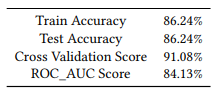
> Table 1: Logistic Regression Accuracies with all features 11

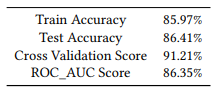
> Table 2: Logistic Regression Accuracies after Removing "RestingECG"

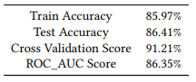
> Table 3: Logistic Regression Accuracies after Removing "RestingBP"

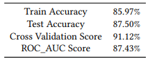
> Table 4: Logistic Regression Accuracies after Removing "RestingECG" and "RestingBP"

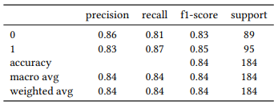
> Table  5: Logistic Regression Matrix after Removing "RestingECG" and "RestingBP"

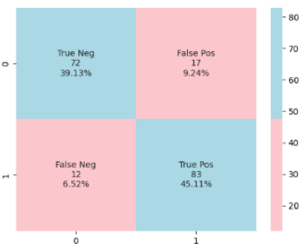
> Figure 10: Logistic Regression Confusion Matrix after Removing "RestingECG" and "RestingBP"

### 4.4. Decision Tree using Random Forest

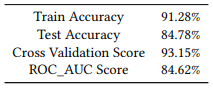
> Table 6: Decision Tree Accuracies with all features 11

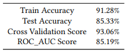
> Table  7: Decision Tree Accuracies after Removing "RestingECG"

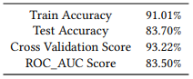
> Table 8: Decision Tree Accuracies after Removing "RestingBP"

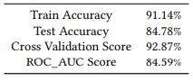
> Table 9: Decision Tree Accuracies after Removing "RestingECG" and "RestingBP"

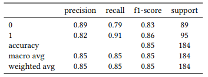
> Table 10: Decision Tree Matrix after Removing "RestingECG" and "RestingBP"

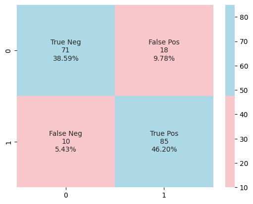
> Figure 11: Decision Tree Confusion Matrix after Removing "RestingECG" and "RestingBP"

### 4.5. Naive Bayes  

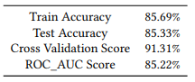
> Table 11: Naive Bayes Accuracies with all features 11

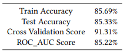
> Table 12: Naive Bayes Accuracies after Removing "RestingECG"

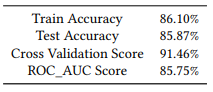
> Table 13:  Naive Bayes Accuracies after Removing "RestingBP"

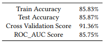
> Table 14: Naive Bayes Accuracies after Removing "RestingECG" and "RestingBP"

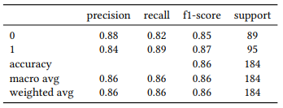
> Table 15: Naive Bayes Matrix after Removing "RestingECG" and "RestingBP"

> Figure 12: Naive Bayes Confusion Matrix after Removing "RestingECG" and "RestingBP"

### 4.6. K-nearest Neighbors Classifier (k=27)

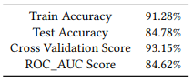
> Table 16: K-nearest neighbors classifier Accuracies with all features 11 (k=27)

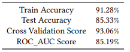
> Table 17: K-nearest neighbors classifier Accuracies after Removing "RestingECG" (k=27)

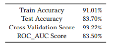
> Table 18: K-nearest neighbors classifier Accuracies after Removing "RestingBP" (k=27)

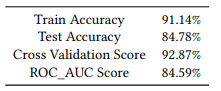
> Table 19: K-nearest neighbors classifier Accuracies after Removing "RestingECG" and "RestingBP" (k=27)

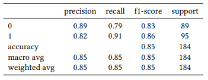
> Table 20: K-nearest neighbors classifier Matrix after Removing "RestingECG" and "RestingBP" (k=27)

> Figure 13: K-nearest neighbors classifier Confusion Matrix after Removing "RestingECG" and "RestingBP" (k=27)

### 4.7. K-nearest Neighbors Classifier (k=10)

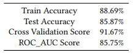
> Table 21: K-nearest neighbors classifier Accuracies (k=10)

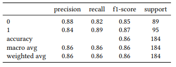
> Table 22: K-nearest neighbors classifier Matrix (k=10)

> Figure 14: K-nearest neighbors classifier Confusion Matrix (k=10)

## 5. CONCLUSION  

After seeing averages of all dataset variations, I choose the 4th option as the most accurate dataset. The model with highest accuracy turns out to be Logistic Regression.

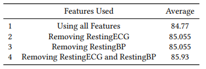
> Table 23: Average Accuracies

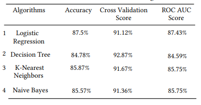
> Table Table 24: Perfomance Metrics for the algorithms
